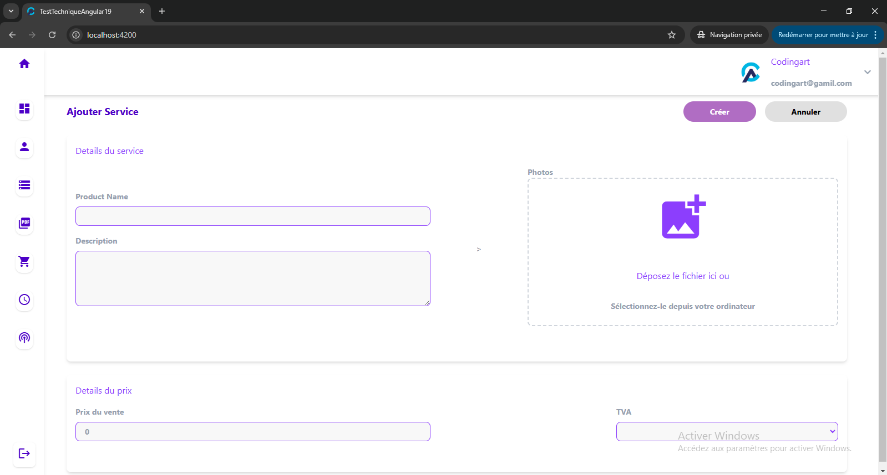
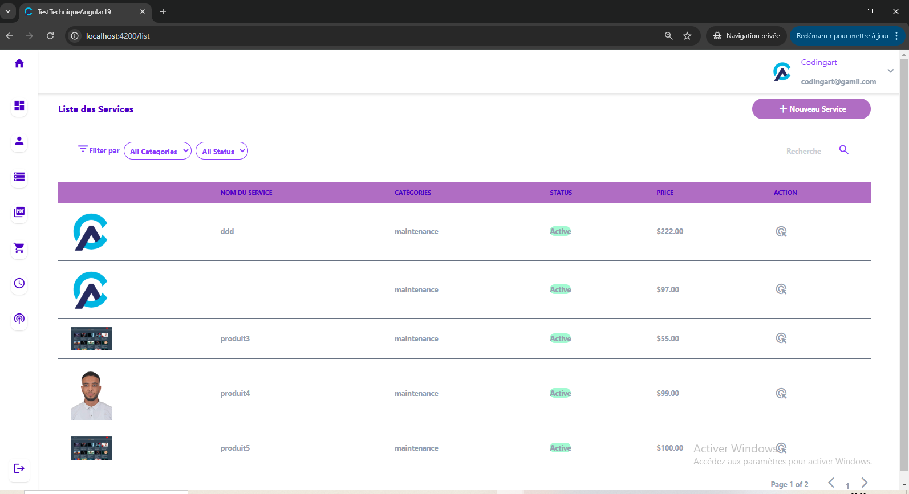
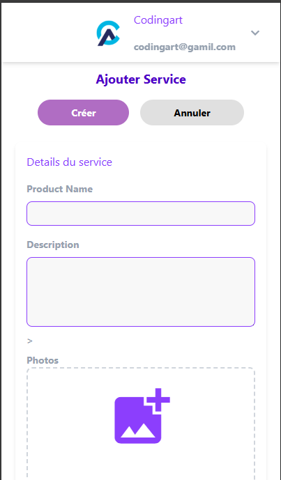
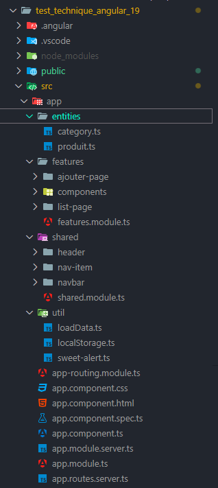
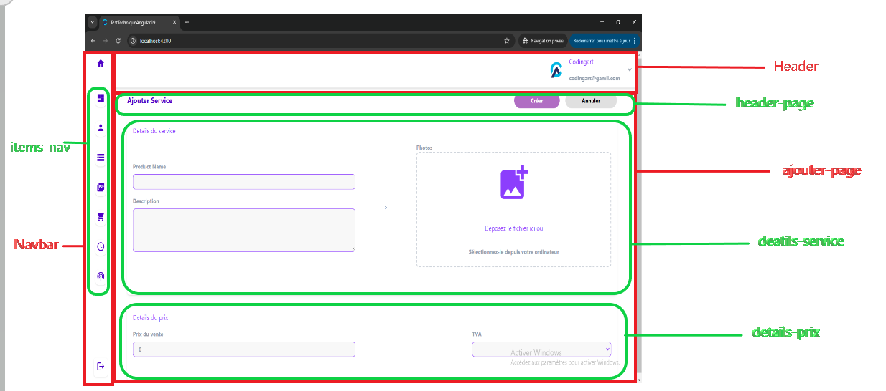
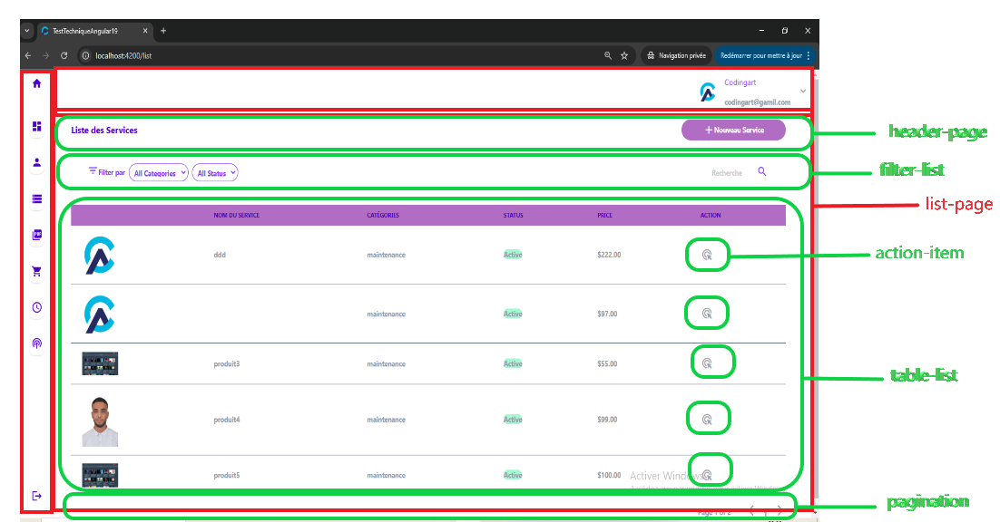

# README - Test

## 1) Interfaces

## 2) Bibliothèques Utilisées
- **Tailwind CSS** : Utilisé pour le stylisme et l'adaptabilité responsive.
- **SweetAlert2** : Pour afficher des popups de confirmation (ex : suppression d'un produit).
- **Material Icons** : Pour intégrer les icônes de l'application.

## 3) Description du Projet
J'ai divisé le projet en plusieurs composants afin d'assurer la réutilisabilité et la maintenabilité du code. J'ai appliqué le principe de **Single Responsibility** pour que chaque composant ait une seule responsabilité.

L'utilisation de **Responsive Tailwind CSS** assure une adaptation fluide de l'application sur tous les types d'appareils.

### 3.1) Structure du Projet

- **entities** : Dossier contenant les interfaces de données (catégories et produits) avec leurs attributs.
- **Features** : Dossier contenant les pages principales de l'application :
  - `list-page` : Affichage de la liste des produits.
  - `ajouter-page` : Formulaire d'ajout d'un produit.
  - **Components** : Dossier contenant les composants réutilisables pour ces pages.
- **Shared** : Dossier regroupant les composants partagés entre les pages, comme `header` et `navbar`.
- **Utils** : Dossier contenant les fonctions utilitaires pour la gestion des données et du stockage local.

### 3.2) Page d'Ajout de Produit (`ajouter-page`)

Cette capture montre la structuration des composants dans la page d'ajout :
- Composants partagés : `header`, `navbar`
- Composants internes : `header-page`, `details-service`, `details-prix`

### 3.3) Page de Liste des Produits (`list-page`)

Cette capture montre l'organisation des composants dans la liste des produits :
- Composants partagés : `header`, `navbar`
- Composants internes : `header-page`, `filter-list`, `table-list`, `pagination`, `action-item`

## 4) Processus d'Ajout d'un Produit
1. **Interfaces** :
   - J'ai créé des interfaces `Category` et `Produit`.
   - Chaque produit a un attribut `category_id` pour l'associer à une catégorie.
2. **Chargement des données** :
   - Récupération des données (`categories`, `produits`) depuis le `localStorage`.
   - Si les catégories sont absentes, des données par défaut sont créées.
3. **Ajout d'un produit** :
   - Lorsqu'un utilisateur clique sur "Créer", le produit est ajouté en prévisualisation.
   - Il est ensuite stocké dans le `localStorage`.

